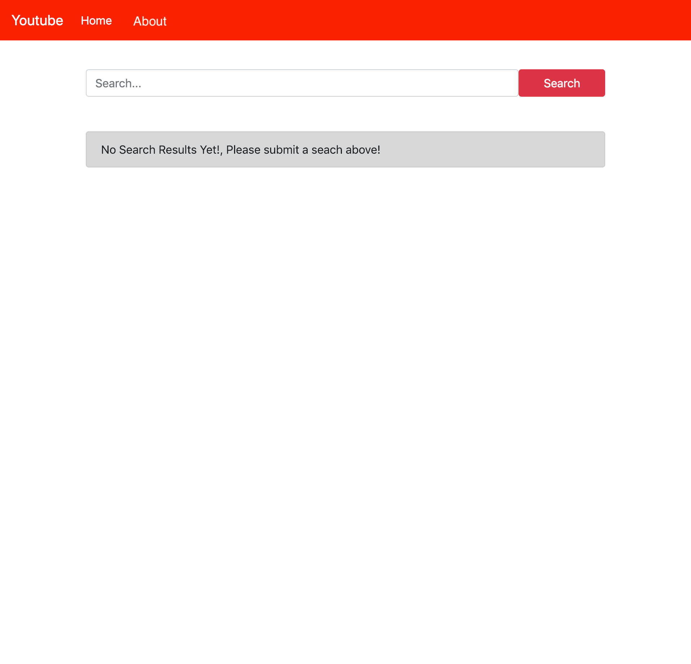

# React YouTube 

Create a react app that lets you search for YouTube videos using the YouTube API, then choose a video from a list to watch.

## Overview

- Collaborate with at least one other person to build this app by using `git` and Github
- Use `create-react-app` 
- Use this guide to make sure you are making the most of [Working in Groups](./Working_In_Groups.md)

## UI

Example Views

### `/`

### `/vidoes/:id`

## User Stories, Acceptance Criteria and Code Quality Rubric

You must implement all of the user stories and acceptance criteria below. After those are completed, look at and implement as many of the stretch features as you want to.

### User Stories
1. I can navigate between the home page and the about page using a nav bar
1. I can learn about the project and developers on the `about` page
1. I can see a search bar on the `home` page that allows me to get a list of videos based on my search criteria
1. I can click on a video thumbnail in order to get to a page that will let me play the video I am interested in
1. I can share the link to the individual video and someone else will be able to see the same video
1. I can visit this app on the Internet

### Acceptance Criteria 

1. I can use the nav bar to navigate between the home page and about page
1. I can see the `about` page that has 
    - the nav bar
    - a brief project description
    - a short bio of each teammate
    - links to each teammate's GitHub
1. I can see the `home` page which has
    - the nav bar 
    - a search bar and submit button
    - will show a list of videos after submitting a search
        - The videos will have a `thumbnail` and `title` that the user can click on to see a new page (`/:id`, see below )
    - will clear the search field after the submit button is pressed
    - I can click on a thumbnail to take me to an individual video page
1. I can see the individual view page of a video. The url will be `/videos/:id` where `id` is the video id from the Youtube API. 
    - the nav bar
    - the individual video view, which is accessible either by clicking a thumbnail from a search on the home page
    - or by clicking on a link provided. I.e. the link `http://localhost:3000/videos/hY7m5jjJ9mM` will always show the same video, whether one gets there from clicking on the home page or on the link provided
    - the video view will, at minimum, have a playable video from YouTube

### Code Quality Rubric

- Use JSX to create components
- Talk with your instructor to commit to either using class based components to manage state **OR** using hooks. 
- Use `create-react-app` to build a React app
- Use `axios` to make an API call
- Use `react-router-dom` to create different views
- Use `youtube-react` to create a Youtube component for viewing videos from the Youtube API
- Respond to user input to make an API call to the YouTube API
- Use state to build a stateful React application
- Use CSS to make a responsive and attractive app with decent UX/UI

### Stretch Features

- Add more inputs to change the search criteria
    - Max number of results (numeric input use HTML5 input to control for min, max and integers
    - Order of videos (date, rating, relevance, title) - maybe a drop down menu
    - Safe search (dropdown) moderate, none, strict
    - Set default relevanceLanguage and/or region code
- Have UI/UX for `something went wrong` for returning a 400 status 
- Adding a favicon (replace the react default one)
- Faux comments section 
    - Lives in state:
    - User input for name to Create comment
    - Add comment specific to video
    - Delete comment
    - Update comment
- Figure out how to store in local storage  

### Super Stretch Features

Figure out how to use Firebase to store comments instead of local storage

## Considerations

## Deploy

Deploy your app following [these instructions](./Deploying_a_React_App_Frontend_to_Netlify.md)
