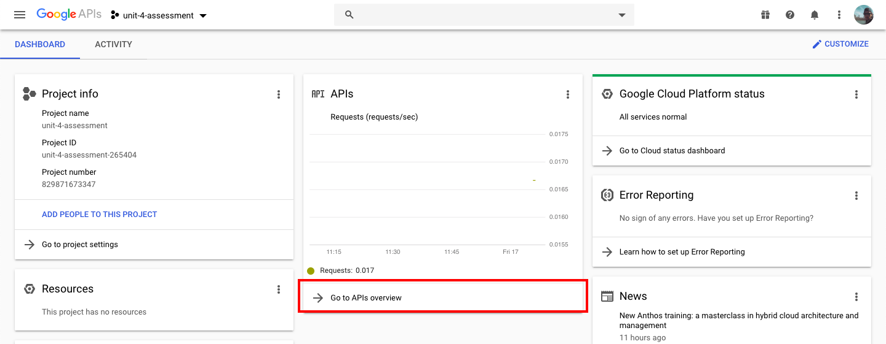
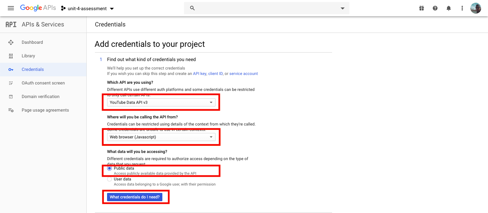

# YouTube API

These instructions will help you to get a YouTube API Key and will describe how to use that API Key in your application.

## How to get an API Key for the Youtube API

You can follow the step by step or watch the video for the instructions.

You will need to go to the [Google Developer Console](https://console.developers.google.com/). Create a project, enable the YouTube Data API v3 and create credentials to access the API.

- [Video Here](http://bit.ly/36ZIMKA)

### Step by Step

1. Go to the [Google Developer Console](https://console.developers.google.com/). Make sure you are logged in in your Google account.

2. In the top left corner locate and click the button `Select Project`

   

3. In the modal that popped up locate and click the button `New project`

   

4. In the [new project page](https://console.developers.google.com/projectcreate) pick a name for your project like `unit-4-assessment` and hit the `create` button.

   

5. A loading animation and your notifications tray should pop up showing your project is being created

   

6. Once your project is created may click on the notification to go to that project's dashboard page. Alternatively you may go back to the [Google Developer Console](https://console.developers.google.com/) and locate the `Select Project` button again and select your project there.

7. In your project's dashboard page locate the button `Go to APIs overview` in the center column under the `APIs` card

   

8. Locate and click the button `+ ENABLE APIS AND SERVICES`.

   

9. Then search for "youtube data api v3" and click on the result YouTube Data API v3.

   

10. In the YouTube API page click the button `ENABLE` and wait a few seconds.

    

11. Once the API is enabled locate the `CREATE CREDENTIALS` on the top right corner and click it.

    

12. Fill out the `Add credentials to your Project` form as seen bellow by selecting `YouTube Data API V3`, `Web Browser(Javascript)` and `Public Data` for the options. Then Click `What credentials do I need` button.

    

13. After the previous step you should have received your API key. Copy it and save it into a file.

    

14. You are done!

## Setting up the API Key

In the root of your project (Same level as `package.json`), run the following command:

- `touch .env`

In the `.gitignore` file add a new line for the following entry:

```
.env
```

We do not want this file to be uploaded to github. We want to keep our API key a secret. **[OR ELSE BAD THINGS CAN HAPPEN](https://www.theregister.com/2015/01/06/dev_blunder_shows_github_crawling_with_keyslurping_bots/)**

The `.env` file is **NOT** JavaScript. Do not use spaces, quotes or semicolons.

The following is an example. This is not an authentic key, you will need to generate your own.

```
REACT_APP_API_KEY=AIzaSyBLR3ihehfi3OXK-UYtucQQBkpnzaaL
```

When you need to use your api key you will do something like this

```js
fetch(
  `https://youtube.googleapis.com/youtube/v3/search?key=${process.env.REACT_APP_API_KEY}`
);
```
